# 🇩🇪[Germany](https://en.wikipedia.org/wiki/Germany)
{: .no_toc }
1. TOC
{:toc}

## [Karlsruhe](https://en.wikipedia.org/wiki/Karlsruhe)

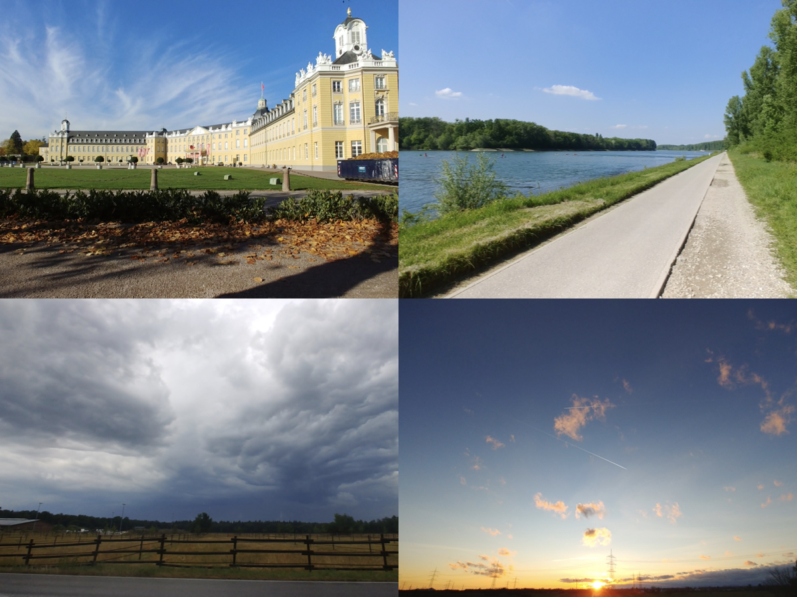

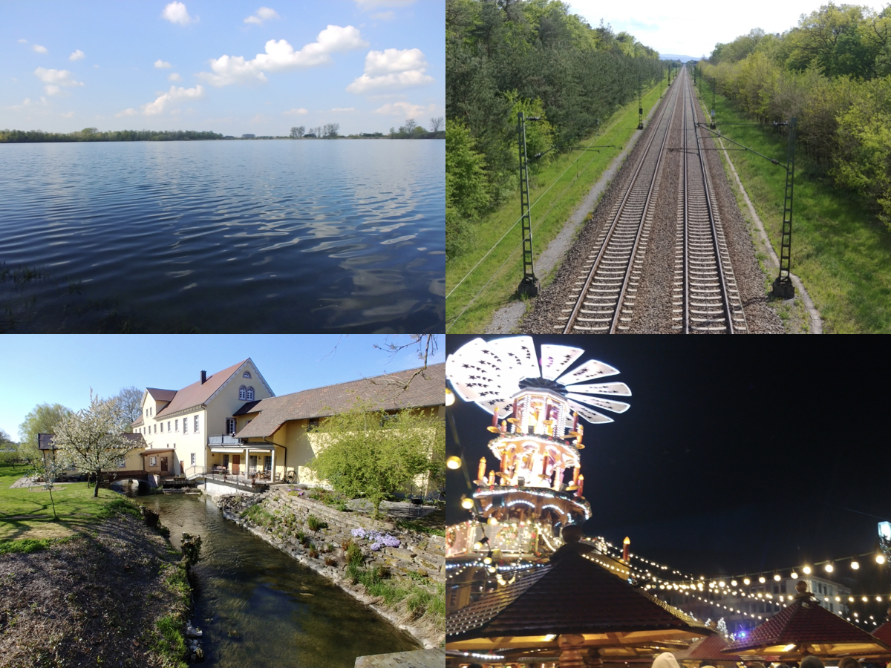

## [Heidelberg](https://en.wikipedia.org/wiki/Heidelberg)

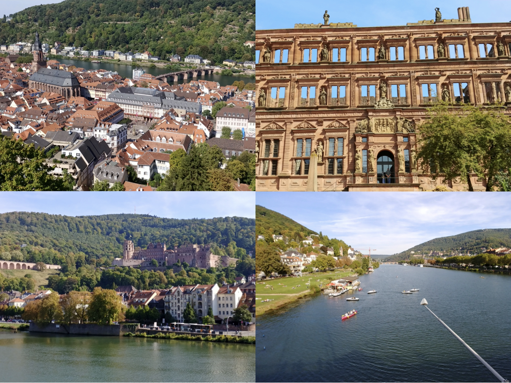

## [Cologne](https://en.wikipedia.org/wiki/Cologne)

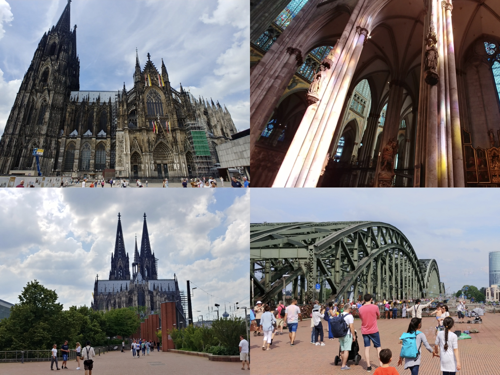

## [Aachen](https://en.wikipedia.org/wiki/Aachen)

## [Freiburg](https://en.wikipedia.org/wiki/Freiburg_im_Breisgau)

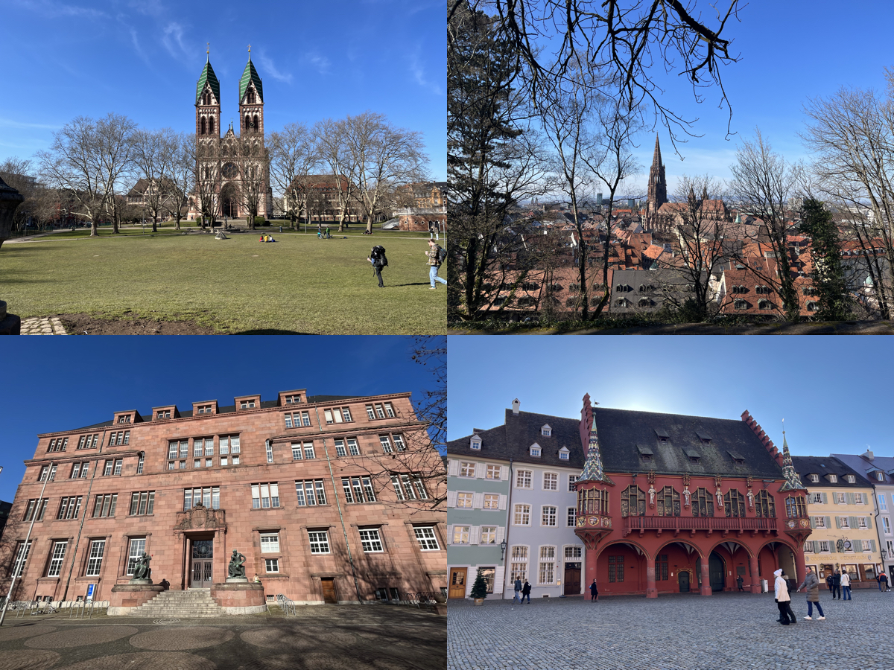

## [Stuttgart](https://en.wikipedia.org/wiki/Stuttgart)

## [Ludwigsburg](https://en.wikipedia.org/wiki/Ludwigsburg)

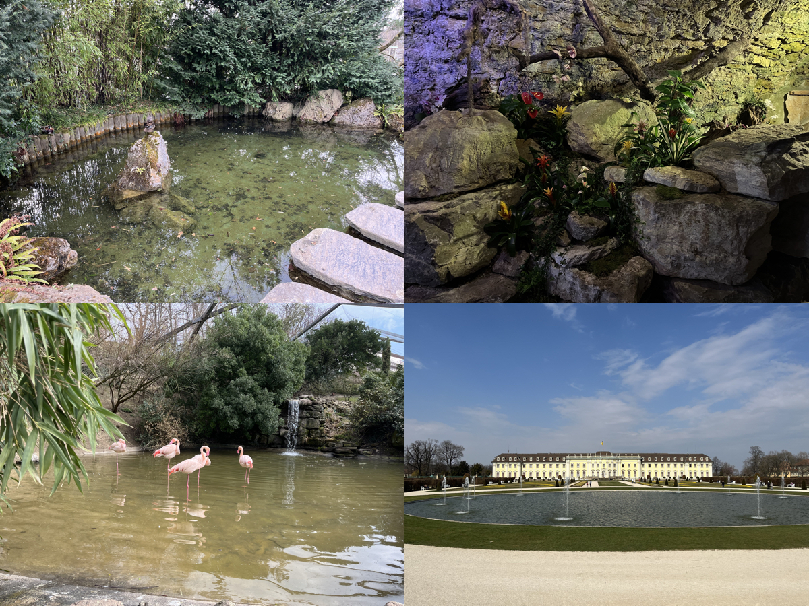

## [Tübingen](https://en.wikipedia.org/wiki/Tübingen)

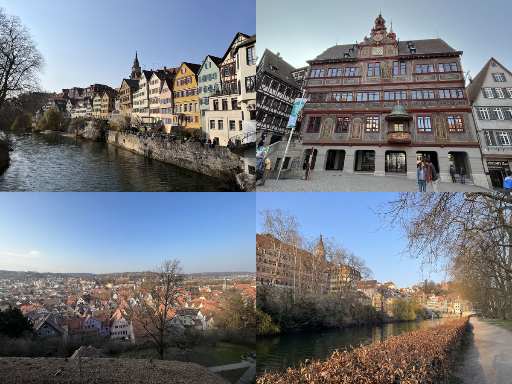

## [Baden-Baden](https://en.wikipedia.org/wiki/Baden-Baden)

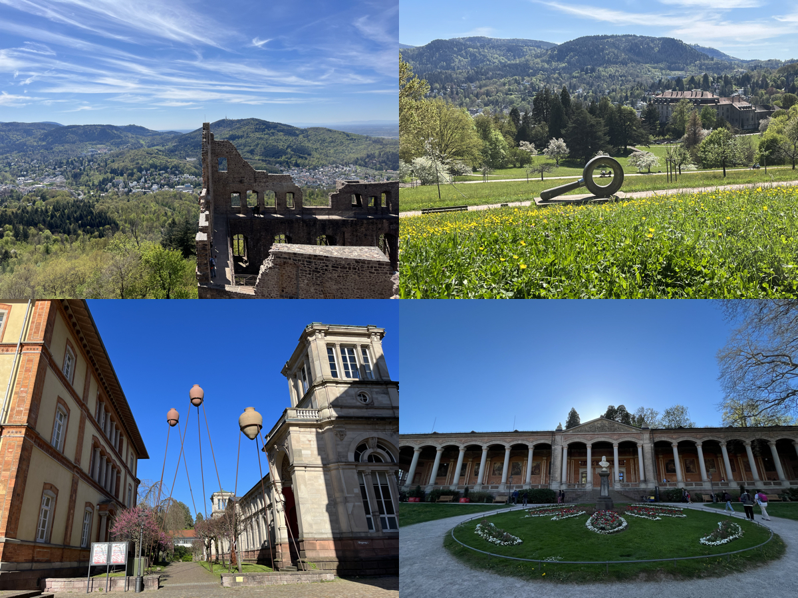

## [Weimar](https://en.wikipedia.org/wiki/Weimar)

## [Wiesbaden](https://en.wikipedia.org/wiki/Wiesbaden)

## [Koblenz](https://en.wikipedia.org/wiki/Koblenz)

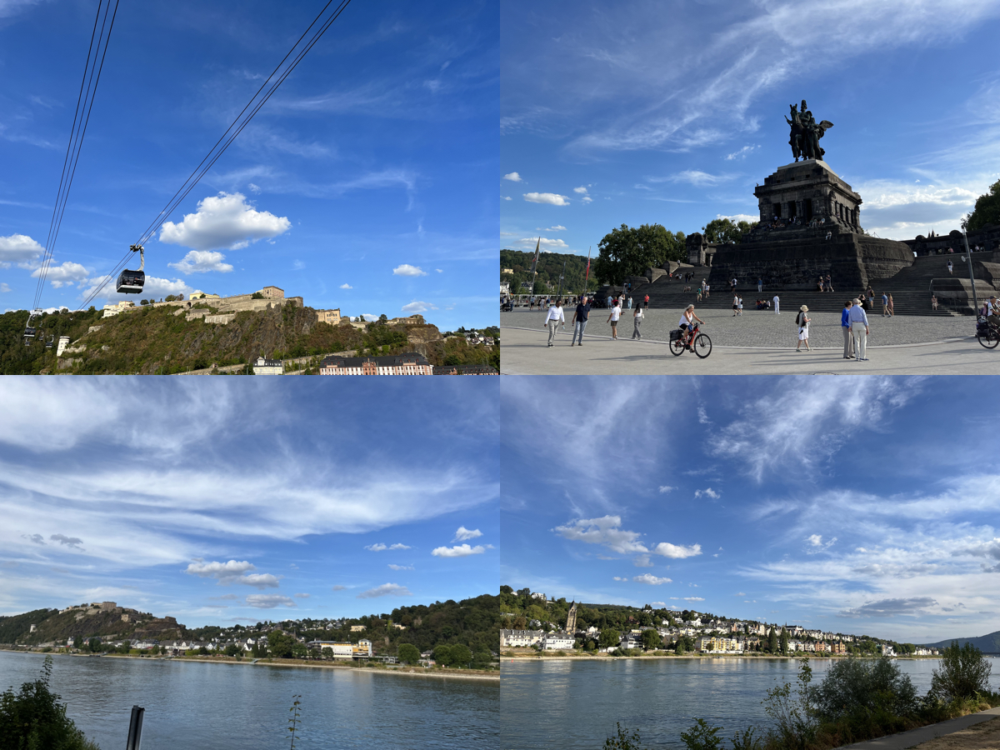

## [Mannheim](https://en.wikipedia.org/wiki/Mannheim)

## [Frankfurt](https://en.wikipedia.org/wiki/Frankfurt)

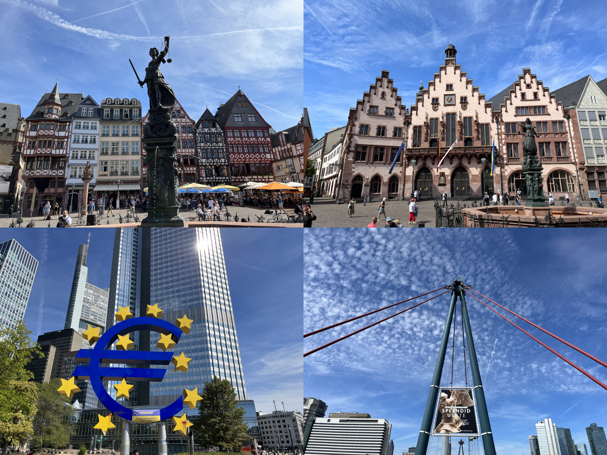

## [Mainz](https://en.wikipedia.org/wiki/Mainz)

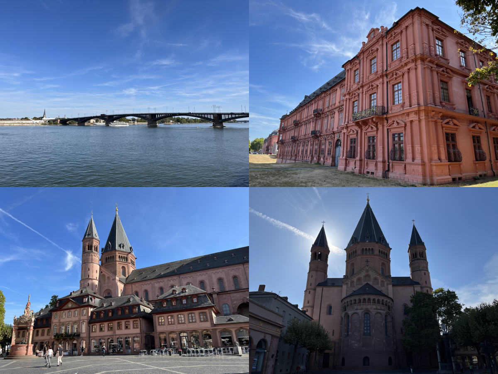