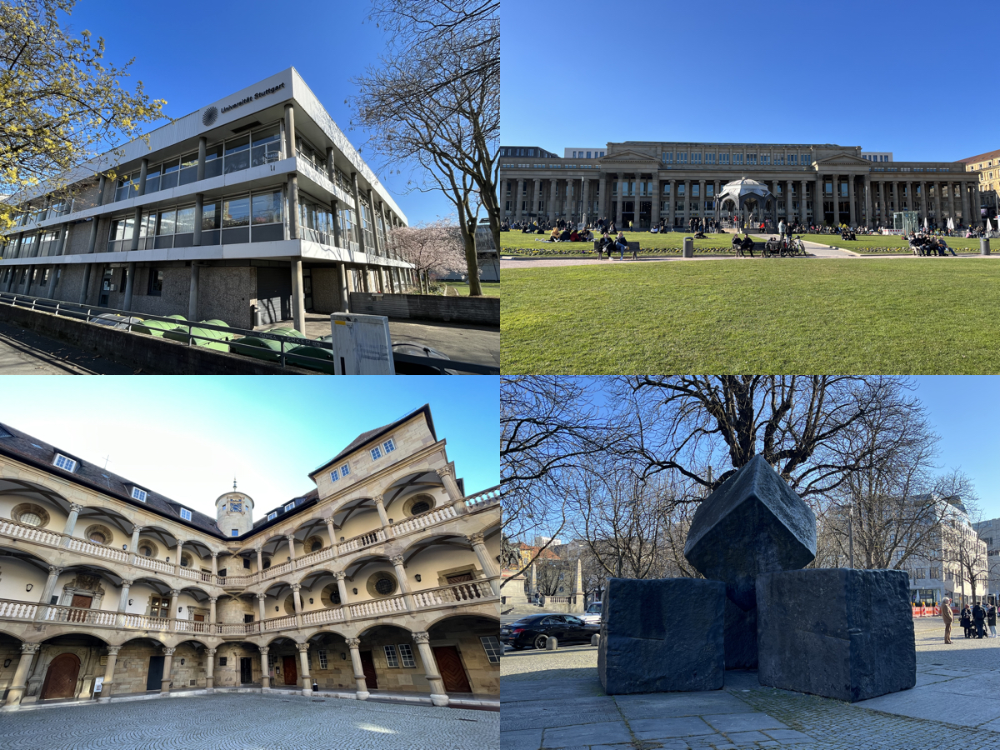
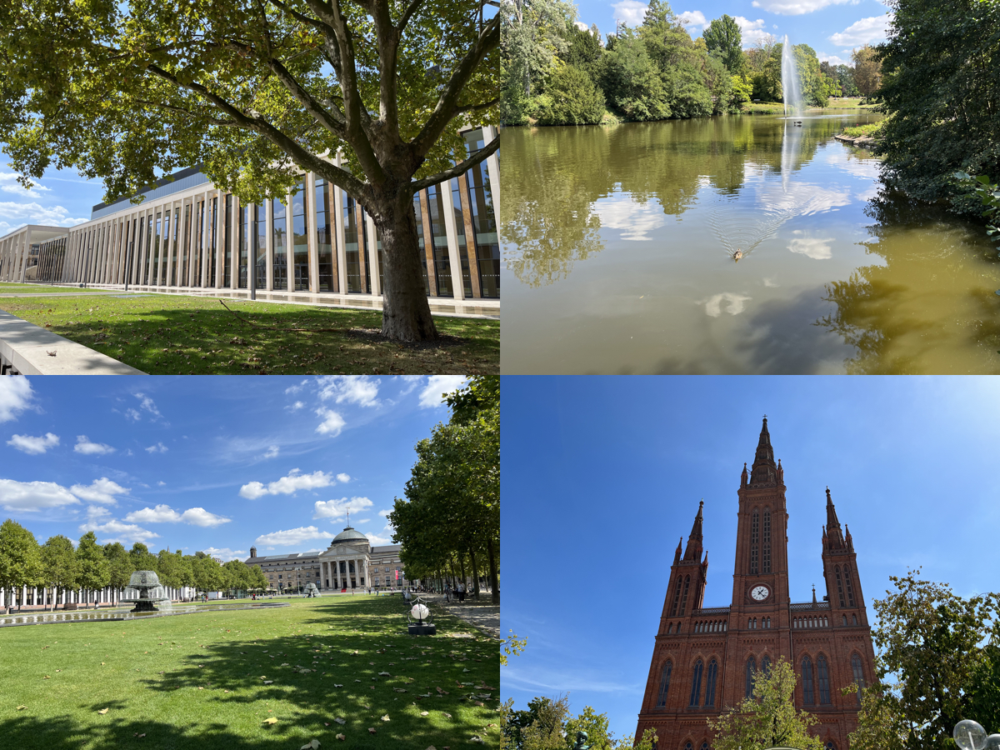
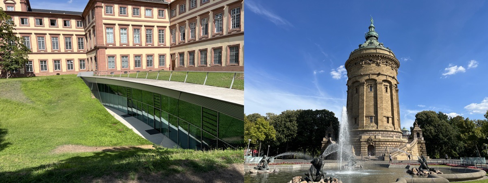

# 🇩🇪[Germany](https://en.wikipedia.org/wiki/Germany)
{: .no_toc }
1. TOC
{:toc}

## [Karlsruhe](https://en.wikipedia.org/wiki/Karlsruhe)

## [Heidelberg](https://en.wikipedia.org/wiki/Heidelberg)

## [Cologne](https://en.wikipedia.org/wiki/Cologne)

## [Aachen](https://en.wikipedia.org/wiki/Aachen)

## [Freiburg](https://en.wikipedia.org/wiki/Freiburg_im_Breisgau)

## [Stuttgart](https://en.wikipedia.org/wiki/Stuttgart)

## [Ludwigsburg](https://en.wikipedia.org/wiki/Ludwigsburg)

## [Tübingen](https://en.wikipedia.org/wiki/Tübingen)

## [Baden-Baden](https://en.wikipedia.org/wiki/Baden-Baden)

## [Weimar](https://en.wikipedia.org/wiki/Weimar)

## [Wiesbaden](https://en.wikipedia.org/wiki/Wiesbaden)

## [Koblenz](https://en.wikipedia.org/wiki/Koblenz)

## [Mannheim](https://en.wikipedia.org/wiki/Mannheim)

## [Frankfurt](https://en.wikipedia.org/wiki/Frankfurt)

## [Mainz](https://en.wikipedia.org/wiki/Mainz)

