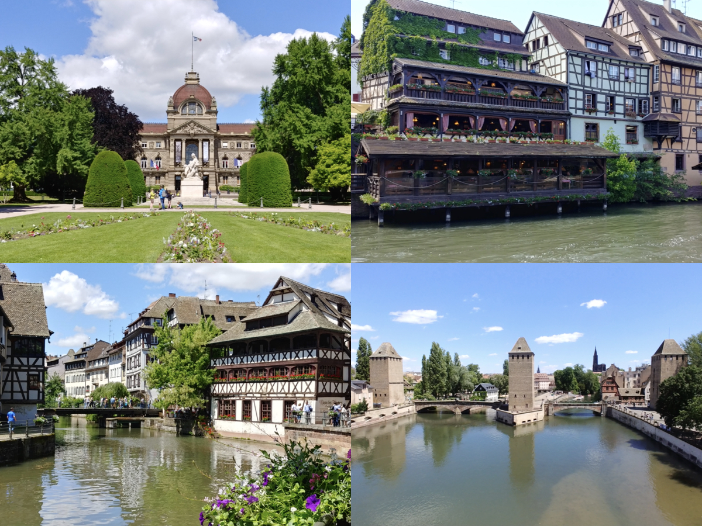
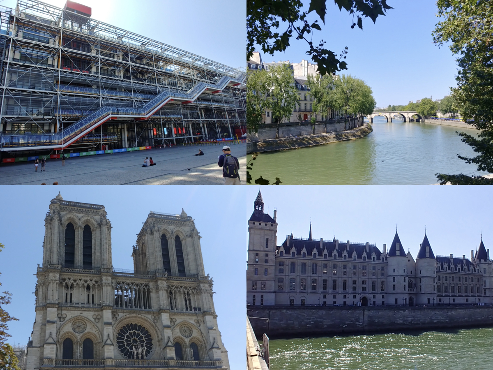
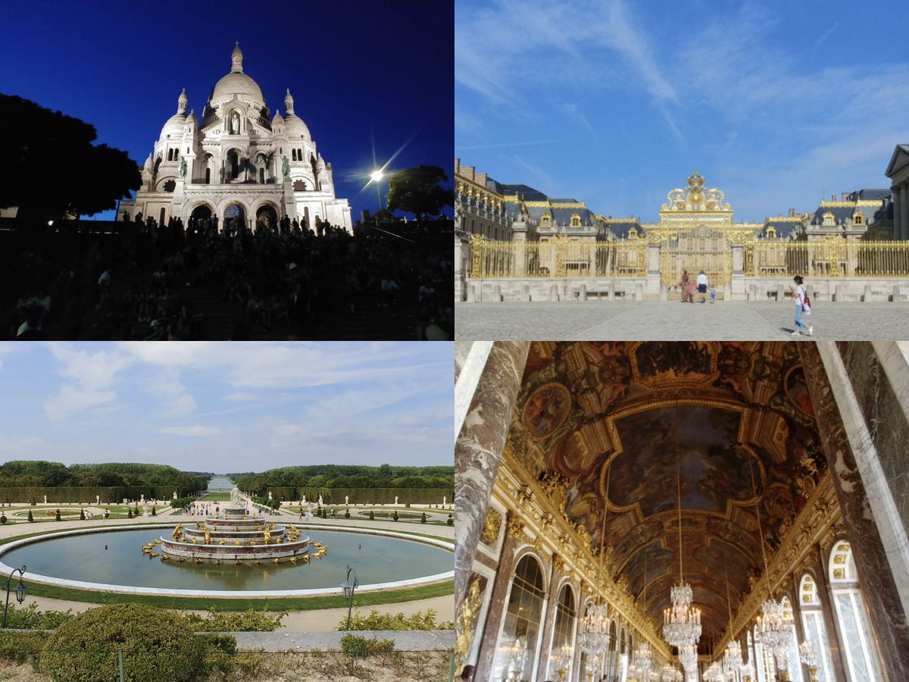
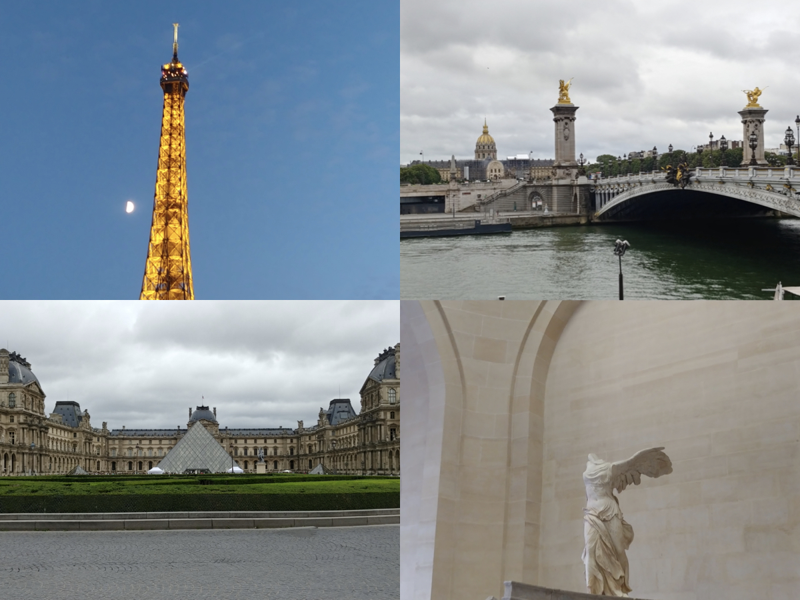

# 🇫🇷[France](https://en.wikipedia.org/wiki/France)
{: .no_toc }
1. TOC
{:toc}

## [Strasbourg](https://en.wikipedia.org/wiki/Strasbourg)

## [Paris](https://en.wikipedia.org/wiki/Paris)

## [Lyon](https://en.wikipedia.org/wiki/Lyon)