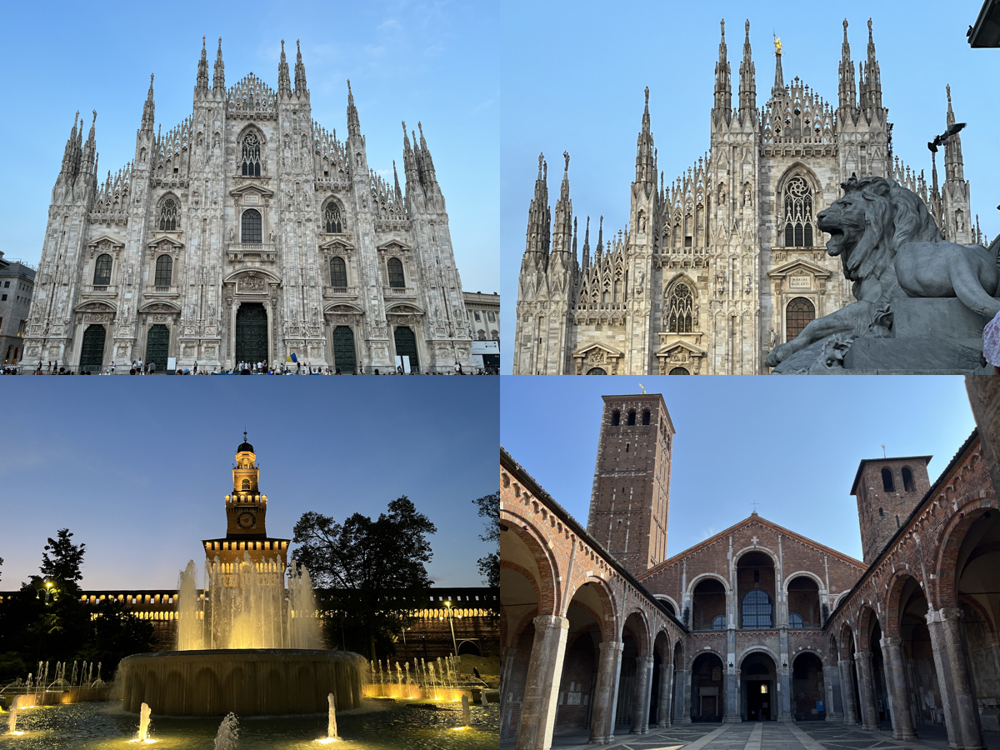
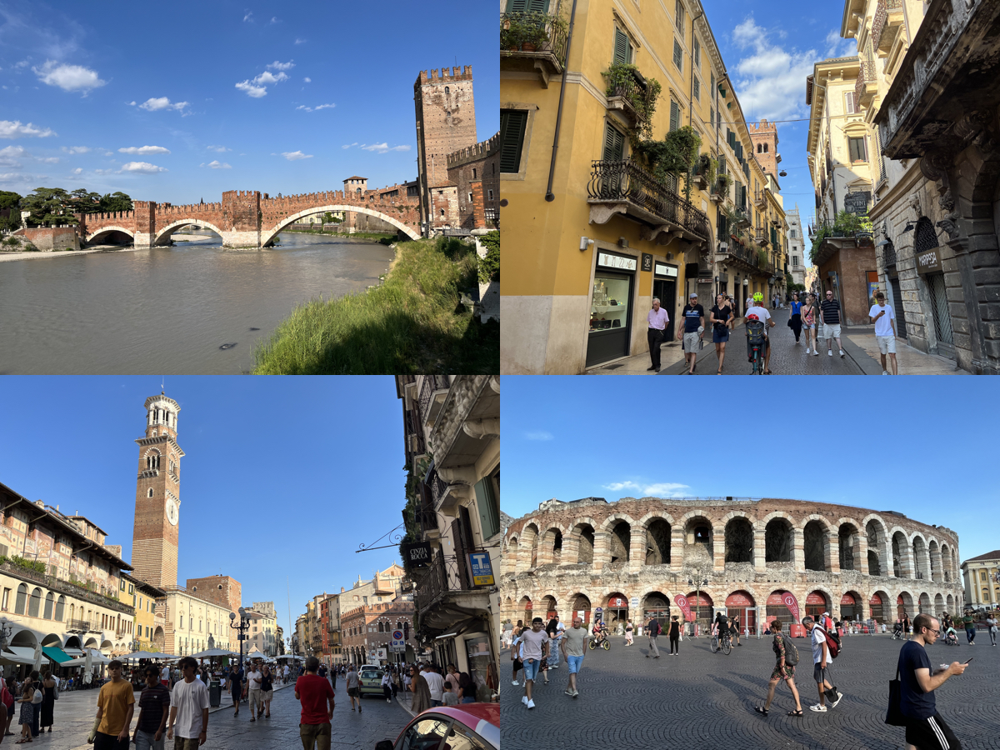
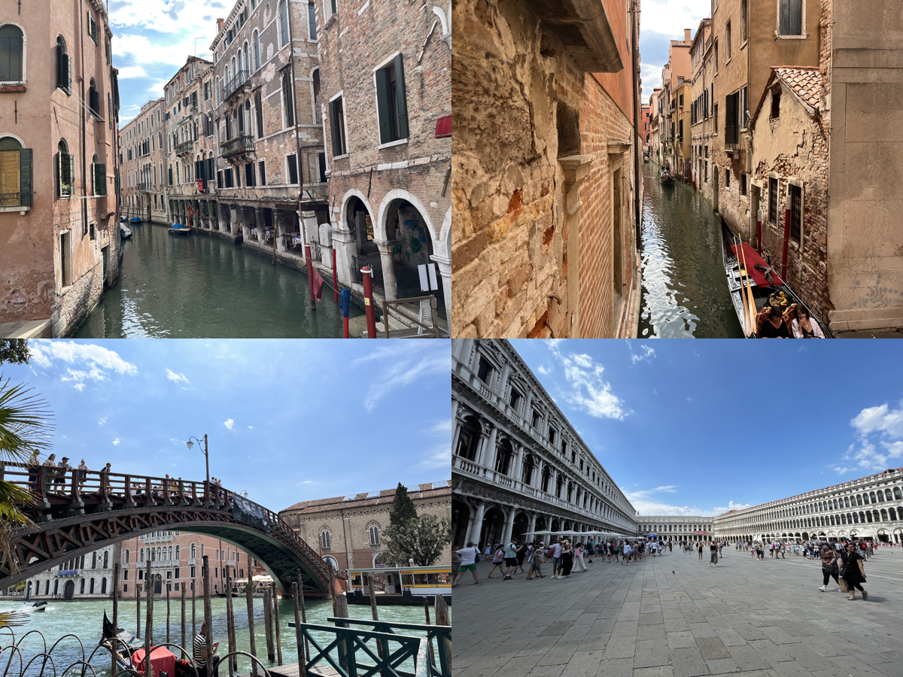
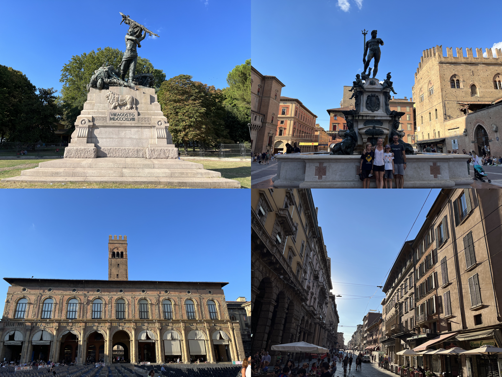
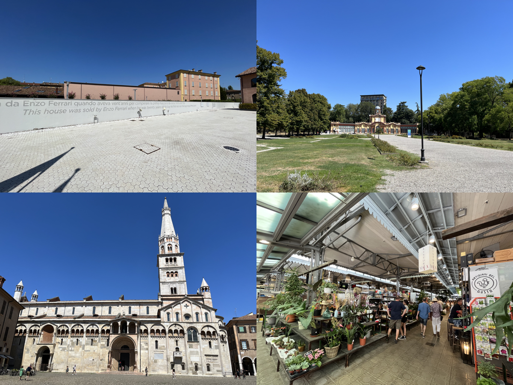
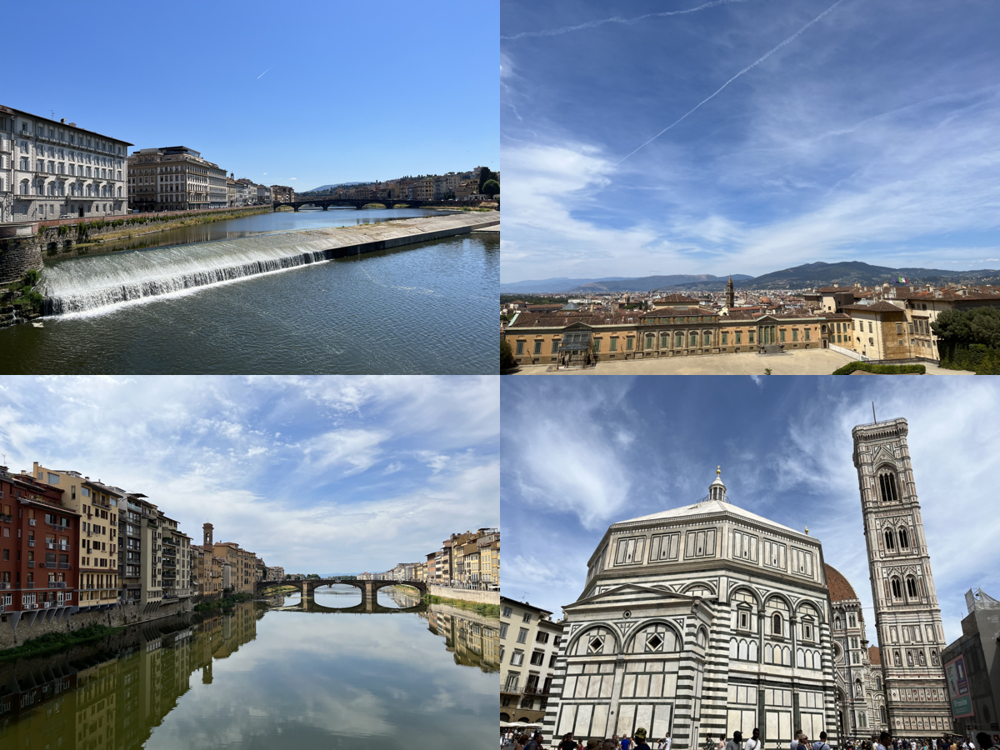
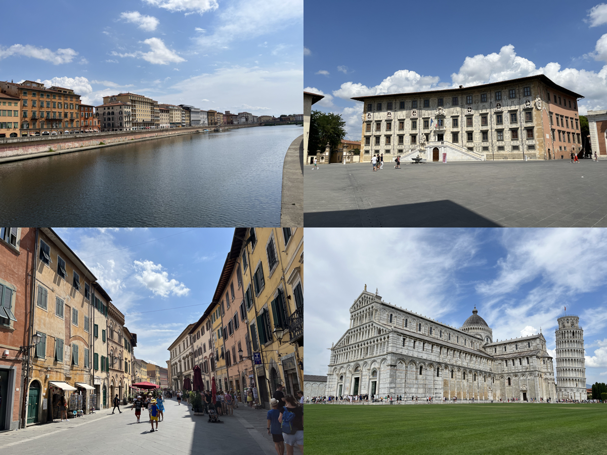
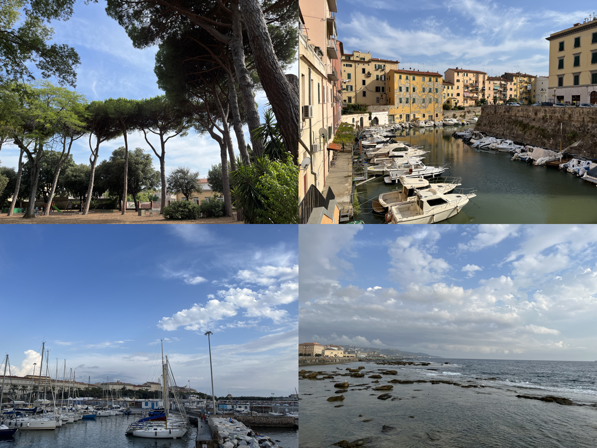

# 🇮🇹[Italy](https://en.wikipedia.org/wiki/Italy)
{: .no_toc }
1. TOC
{:toc}

## [Milan](https://en.wikipedia.org/wiki/Milan)

## [Verona](https://en.wikipedia.org/wiki/Verona)

## [Venice](https://en.wikipedia.org/wiki/Venice)

## [Bologna](https://en.wikipedia.org/wiki/Bologna)

## [Modena](https://en.wikipedia.org/wiki/Modena)

## [Florence](https://en.wikipedia.org/wiki/Florence)

## [Pisa](https://en.wikipedia.org/wiki/Pisa)

## [Livorno](https://en.wikipedia.org/wiki/Livorno)

