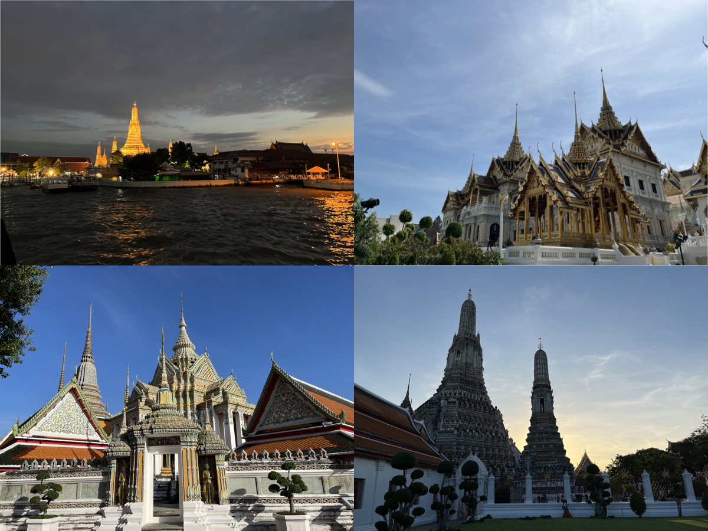
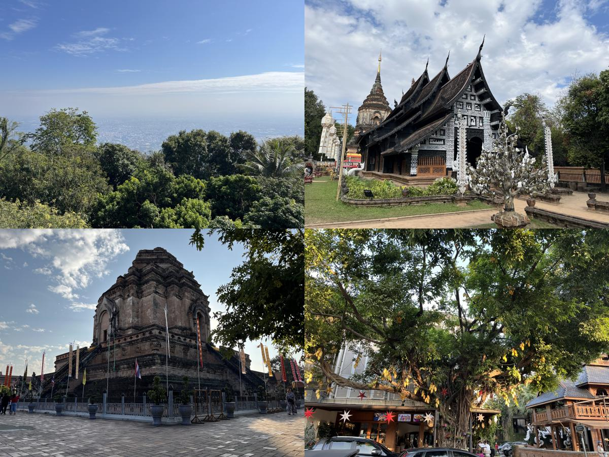
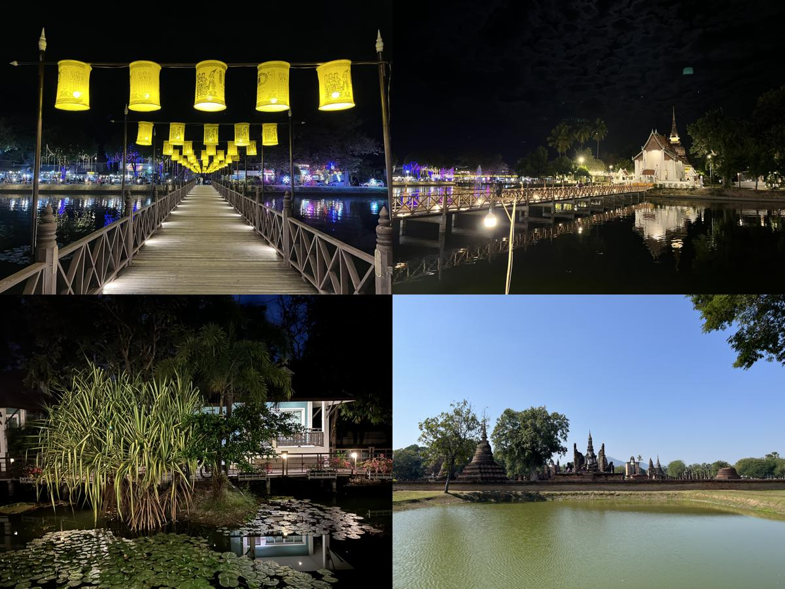

# 🇹🇭[Thailand](https://en.wikipedia.org/wiki/Thailand)
{: .no_toc }
1. TOC
{:toc}

## [Bangkok](https://en.wikipedia.org/wiki/Bangkok)

## [Chiang Mai](https://en.wikipedia.org/wiki/Chiang_Mai)

## [Sukhothai](https://en.wikipedia.org/wiki/Sukhothai_(city))

